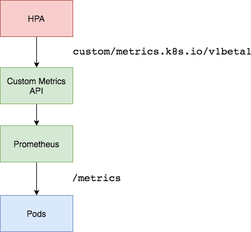

name: inverse
layout: true
class: center, middle, inverse

---

# Kubernetes Autoscaling

using Custom Metrics
.footnote[By Dimitris Kapanidis [@spiddy](https://twitter.com/spiddy/)]

---

## About me

Docker Captain | Google Developer Expert

Docker BCN Community Leader | Kubernetes BCN Meetup Organizer

Day Job Consulting @ [Harbur Cloud Solutions](https://harbur.io)

---

# Kubernetes API

Let's get the basics first

---

layout: false

layout: false
.left-column[

### Pods

]
.right-column[

* A [Pod](https://kubernetes.io/docs/concepts/workloads/pods/pod/) is the smallest deployable units of computing.

* It can contain one or more containers.

* Rule-of-thumb: one container on each Pod if unsure.

]

.footnote[
.red[*] e.g. I want to run an instance of my [PokemonDeck]() container
]

---

layout: false

layout: false
.left-column[

### Pods

### RC

]
.right-column[

* A [ReplicationController](https://kubernetes.io/docs/concepts/workloads/controllers/replicationcontroller/) ensures that a specified number of pod replicas are up.

* .red[IMPORTANT:] deprecated by ReplicationSets.

]

.footnote[
.red[*] e.g. I want to run X instances of my [PokemonDeck]() Pod
]

---

layout: false

layout: false
.left-column[

### Pods

### RC

### RS

]

.right-column[

* [ReplicaSet](https://kubernetes.io/docs/concepts/workloads/controllers/replicaset/) is the next-gen ReplicationController.

* Improved selector support in comparison with RC.

]

.footnote[
.red[*] e.g. I want to run X instances of my [PokemonDeck]() Pod
]

---

layout: false
.left-column[

### Pods

### RC

### RS

### Deployments

]

.right-column[

* A [Deployment](https://kubernetes.io/docs/concepts/workloads/controllers/deployment/) controller provides declarative updates for Pods and ReplicaSets.

* The Rollout of the updates is managed by Kubernetes facilitating zero-downtimes during rollout.

]

.footnote[
.red[*] e.g. I want to run [PokemonDeck v1]() ReplicaSet with X instances of Pod

.red[*] e.g. I want to upgrade to [PokemonDeck v2]() ReplicaSet with X instances of Pod
]

---

layout: false
.left-column[

### Pods

### RC

### RS

### Deployments

### DaemonSets

]

.right-column[

* A [DaemonSet](https://kubernetes.io/docs/concepts/workloads/controllers/daemonset/) ensures that all (or some) Nodes run a copy of a Pod.

* You can use a nodeSelector to limit to a subset of nodes.

* It will scale automatically if new nodes are added.

]

.footnote[
.red[*] e.g. I want to run an instance of [PokemonDeck]() Pod on all nodes with SSD disk
]

---

layout: false
.left-column[

### Pods

### RC

### RS

### Deployments

### DaemonSets

### StatefulSets

]

.right-column[

* A [StatefulSet](https://kubernetes.io/docs/concepts/workloads/controllers/statefulset/) is the workload API object used to manage stateful applications.

]

.footnote[
.red[*] e.g. I want to run 4 instances with names [1..4] of [PokemonDeck]() Pod
]

---

name: inverse
layout: true
class: center, middle, inverse

---

# Kubernetes Autoscaling

The two dimensions

---

layout: false
.left-column[

### Cluster Autoscaling

]
.right-column[

* [Cluster Autoscaling](https://kubernetes.io/docs/tasks/administer-cluster/cluster-management/#cluster-autoscaling) is responsible of adding/removing nodes to the Cluster.

* Its implementation is Cloud-provider specific.

* It deals with scaling the capacity of the cluster to run the desired workfload.

]

---

layout: false
.left-column[

### Cluster Autoscaling

### Horizontal Pod Autoscaling

]
.right-column[

* [Horizontal Pod Autoscaler](https://kubernetes.io/docs/tasks/run-application/horizontal-pod-autoscale-walkthrough/) automatically scales the number of pods in a scalable resource based on metrics.

* Scalable resources:

  * ReplicationController
  * Deployment
  * ReplicaSet
  * StatefulSet (coming soon)

* Metrics:

  * CPU usage
  * Memory usage
  * **Custom metrics**

]

---

.left-column[

### Cluster Autoscaling

### Horizontal Pod Autoscaling

]
.right-column[


]

---

name: inverse
layout: true
class: center, middle, inverse

---

# Horizontal Pod Autoscaling

the new version

---

layout: false

.left-column[

### Horizontal Pod Autoscaling

]

.right-column[

* The Horizontal Pod Autoscaler is an API resource in the Kubernetes `autoscaling` API group.

* There are different versions of HPA.

* .red[NOTE:] For HPA to take action on CPU/Memory, there needs to be request resources defined.

]

---

.left-column[

### Horizontal Pod Autoscaling

autoscaling/v1

]

.right-column[

* `autoscaling/v1` is the current stable version.

* It includes support only for **CPU** autoscaling.

]

---

.left-column[

### Horizontal Pod Autoscaling

autoscaling/v1

autoscaling/v2beta1

]

.right-column[

* `autoscaling/v2beta1` is the beta version.

* It includes support for scaling on:

  * Resource Metrics API (CPU, Memory)
  * Custom Metrics API

* `horizontal-pod-autoscaler-use-rest-clients` flag should be true on kube-controller-manager (default since `1.9`)

]

---

.left-column[

### Horizontal Pod Autoscaling

### Metrics Aggregation

]

.right-column[

* The aggregation layer enables installing additional Kubernetes-style APIs in your cluster.

* These can either be pre-built, existing 3rd party solutions, such as service-catalog, or user-created APIs like apiserver-builder, which can get you started.

* In 1.7 the aggregation layer runs in-process with the kube-apiserver. Until an extension resource is registered, the aggregation layer will do nothing. To register an API, users must add an APIService object, which “claims” the URL path in the Kubernetes API. At that point, the aggregation layer will proxy anything sent to that API path (e.g. `/apis/myextension.mycompany.io/v1/…`) to the registered APIService.

]

---

.left-column[

### Horizontal Pod Autoscaling

### Metrics Aggregation

### Design

]

.right-column[


]

.footnote.left[<https://www.weave.works/blog/kubernetes-horizontal-pod-autoscaler-and-prometheus>]

---

name: inverse
layout: true
class: center, middle, inverse

---

# Demo

## Autoscaling with Custom Metrics

Let's do this!

---

layout: false

.left-column[

### Minikube

]
.right-column[

Let's start a Minikube in order to provide us a local Kubernetes Cluster

```bash
$ minikube version

minikube version: v0.25.0
```

```bash
$ minikube start

Starting local Kubernetes v1.9.0 cluster...
Starting VM...
Getting VM IP address...
Moving files into cluster...
Setting up certs...
Connecting to cluster...
Setting up kubeconfig...
Starting cluster components...
Kubectl is now configured to use the cluster.
Loading cached images from config file.
```

```bash
$ kubectl get node

NAME       STATUS    ROLES     AGE       VERSION
minikube   Ready     <none>    31s       v1.9.0
```

]

---

layout: false

.left-column[

### Minikube

]
.right-column[

We'll need Heapster running to collect metrics so make sure it the `heapster` addon is enabled:

```bash
$ minikube addons enable heapster
heapster was successfully enabled
```

Once the service is up you'll be able to see it by doing:

```bash
minikube addons open heapster
```

]

---

layout: false

.left-column[

### Minikube

### Metrics Server

]
.right-column[


* MS is a cluster-wide aggregator of resource usage data, successor of Heapster.
* MS collects CPU and memory usage for nodes and pods by pooling data from the kubernetes.summary_api.
* The summary API is a memory-efficient API for passing data from Kubelet/cAdvisor to the metrics server.

]

---

layout: false

.left-column[

### Minikube

### Metrics Server

]
.right-column[

Now we'll need the [Metrics Server](https://github.com/kubernetes-incubator/metrics-server) running.

Let's deploy it:

```bash
$ kubectl create -f metrics-server
clusterrolebinding "metrics-server:system:auth-delegator" created
rolebinding "metrics-server-auth-reader" created
apiservice "v1beta1.metrics.k8s.io" created
serviceaccount "metrics-server" created
deployment "metrics-server" created
service "metrics-server" created
clusterrole "system:metrics-server" created
clusterrolebinding "system:metrics-server" created
```

]

.footnote.left[<https://github.com/kubernetes-incubator/metrics-server/tree/master/deploy/1.8+>]

---

layout: false

.left-column[

### Minikube

### Metrics Server

]
.right-column[

It should be deployed in the `kube-system` namespace.

We can check if it is running:

```bash
$ kubectl get pod -n kube-system -l k8s-app=metrics-server

NAME                             READY     STATUS    RESTARTS   AGE
metrics-server-bb9ffc6b8-4nfh8   1/1       Running   0          2m
```

]

---

.left-column[

### Minikube

### Metrics Server

]
.right-column[

We can now ask the CPU and memory metrics for Nodes:

```json
$ kubectl get --raw \
"/apis/metrics.k8s.io/v1beta1/nodes" | \
jq ".items[]"

{
  "metadata": {
    "name": "minikube",
    "selfLink": "/apis/metrics.k8s.io/v1beta1/nodes/minikube",
    "creationTimestamp": "2018-03-16T17:09:02Z"
  },
  "timestamp": "2018-03-16T17:08:00Z",
  "window": "1m0s",
  "usage": {
    "cpu": "198m",
    "memory": "1287784Ki"
  }
}
```

]

---

.left-column[

### Minikube

### Metrics Server

]

.right-column[

We can also ask the CPU and memory metrics for Pods:

```json
$ kubectl get --raw \
"/apis/metrics.k8s.io/v1beta1/pods" | \
jq '.items[0]'

{
  "metadata": {
    "name": "default-http-backend-z96mt",
    "namespace": "kube-system",
    "selfLink": "/apis/metrics.k8s.io/v1beta1/namespaces/kube-system/pods/default-http-backend-z96mt",
    "creationTimestamp": "2018-03-16T17:09:37Z"
  },
  "timestamp": "2018-03-16T17:09:00Z",
  "window": "1m0s",
  "containers": [
    {
      "name": "default-http-backend",
      "usage": {
        "cpu": "0",
        "memory": "2192Ki"
      }
    }
  ]
}
```

]

---

.left-column[

### Minikube

### Metrics Server

### Demo Deployment

]

.right-column[

We can now deploy an application:

```bash
$ kubectl create -f \
./podinfo/podinfo-svc.yaml,./podinfo/podinfo-dep.yaml

service "podinfo" created
deployment "podinfo" created
```

The demo is exposed at: <http://192.168.99.100:31198/>

]

.footnote.left[<https://github.com/stefanprodan/k8s-prom-hpa/tree/master/podinfo>]

---

.left-column[

### Minikube

### Metrics Server

### Demo Deployment

]

.right-column[

We can now configure Autoscaling using memory and CPU:

```yaml
apiVersion: autoscaling/v2beta1
kind: HorizontalPodAutoscaler
metadata:
  name: podinfo
spec:
  scaleTargetRef:
    apiVersion: extensions/v1beta1
    kind: Deployment
    name: podinfo
  minReplicas: 2
  maxReplicas: 10
  metrics:
  - type: Resource
    resource:
      name: cpu
      targetAverageUtilization: 80
  - type: Resource
    resource:
      name: memory
      targetAverageValue: 200Mi
```

```bash
$ kubectl create -f ./podinfo/podinfo-hpa.yaml

horizontalpodautoscaler "podinfo" created
```

]

---

.left-column[

### Minikube

### Metrics Server

### Demo Deployment

]

.right-column[

After a few seconds we can see that HPA fetches the metrics properly:

```bash
$ kubectl get hpa

NAME      REFERENCE            TARGETS                     MINPODS   MAXPODS   REPLICAS   AGE
podinfo   Deployment/podinfo   5072896 / 200Mi, 0% / 80%   2         10        2          38s
```

Let hit it with some traffic:

```sh
$ brew install wrk
...
==> Pouring wrk-4.1.0.sierra.bottle.tar.gz
🍺  /usr/local/Cellar/wrk/4.1.0: 7 files, 2.6MB

$ wrk -t12 -c40 -d3m http://192.168.99.100:31198/
```

]

---

.left-column[

### Minikube

### Metrics Server

### Demo Deployment

]

.right-column[

To monitor the HPA events:

```bash
$ kubectl describe hpa
Events:
  Type     Reason                        Age               Fr
  ----     ------                        ----              --
  Normal   SuccessfulRescale             4s                ho
rizontal-pod-autoscaler  New size: 4; reason: cpu resource
utilization (percentage of request) above target
```

Stop the load test and remove the Deploy and HPA:

```bash
kubectl delete deploy/podinfo hpa/podinfo
```

]

---

.left-column[

### Minikube

### Metrics Server

### Demo Deployment

### Prometheus

]

.right-column[

We'll use Prometheus v2 to store the data:

```bash
kubectl create ns monitoring
kubectl create -f ./prometheus
```

Prometheus is configured to be exposed <http://192.168.99.100:31190>

(Replace 192.168.99.100 with your minikube ip)

]

---

.left-column[

### Minikube

### Metrics Server

### Demo Deployment

### Prometheus

### Custom Metrics API

]

.right-column[



]

---

.left-column[

### Minikube

### Metrics Server

### Demo Deployment

### Prometheus

### Custom Metrics API

]

.right-column[

Let's install now the Custom Metrics API:

```bash
cd custom-metrics-api/

# Generate TLS Certificates needed by Prometheus
./gencerts.sh

# Deploy Custom Metrics API adapter
./deploy.sh
```

]

.footnote.left[https://github.com/coreos/prometheus-operator/tree/master/contrib/kube-prometheus/manifests/custom-metrics-api]

---

.left-column[

### Minikube

### Metrics Server

### Demo Deployment

### Prometheus

### Custom Metrics API

]

.right-column[

List the custom metrics provided by Prometheus:

```sh
kubectl get --raw "/apis/custom.metrics.k8s.io/v1beta1" \
| jq .
```

Get the FS usage for all the pods in the monitoring namespace:

```sh
kubectl get --raw "/apis/custom.metrics.k8s.io"\
"/v1beta1/namespaces/monitoring/pods/*/fs_usage_bytes" \
| jq .
```

]

---

.left-column[

### Minikube

### Metrics Server

### Demo Deployment

### Prometheus

### Custom Metrics API

### Auto Scaling with Custom Metrics

]

.right-column[

Create podinfo NodePort service and deployment in the default namespace:

```sh
kubectl create -f ./podinfo/podinfo-svc.yaml,./podinfo/podinfo-dep.yaml
```

The podinfo app exposes a custom metric named `http_requests_total`. The Prometheus adapter removes the `_total` suffix and marks the metric as a counter metric.

Get the total requests per second from the custom metrics API:

```sh
kubectl get --raw "/apis/custom.metrics.k8s.io/v1beta1/namespaces/default/pods/*/http_requests" | jq .
```

]

---

.left-column[

### Minikube

### Metrics Server

### Demo Deployment

### Prometheus

### Custom Metrics API

### Auto Scaling with Custom Metrics

]

.right-column[

Create a HPA that will scale up the `podinfo` deployment if the number of requests goes over 10 per second:

```yaml
apiVersion: autoscaling/v2beta1
kind: HorizontalPodAutoscaler
metadata:
  name: podinfo
spec:
  scaleTargetRef:
    apiVersion: extensions/v1beta1
    kind: Deployment
    name: podinfo
  minReplicas: 2
  maxReplicas: 10
  metrics:
  - type: Pods
    pods:
      metricName: http_requests
      targetAverageValue: 10
```

Deploy the podinfo HPA in the `default` namespace:

```sh
kubectl create -f ./podinfo/podinfo-hpa-custom.yaml
```

]

---

.left-column[

### Minikube

### Metrics Server

### Demo Deployment

### Prometheus

### Custom Metrics API

### Auto Scaling with Custom Metrics

]

.right-column[

Let hit it with some traffic:

```sh
wrk -t12 -c40 -d3m http://192.168.99.100:31198/
```

]

---

.left-column[

### Wrapping up

]

.right-column[

* Metrics can help drive autoscaling.

* CPU/Memory is ok, but sometimes not good enough.

* Usage metrics such as requests/sec is now possible with custom metrics.

]

---

name: inverse
layout: true
class: center, middle, inverse

---

# Thank You
